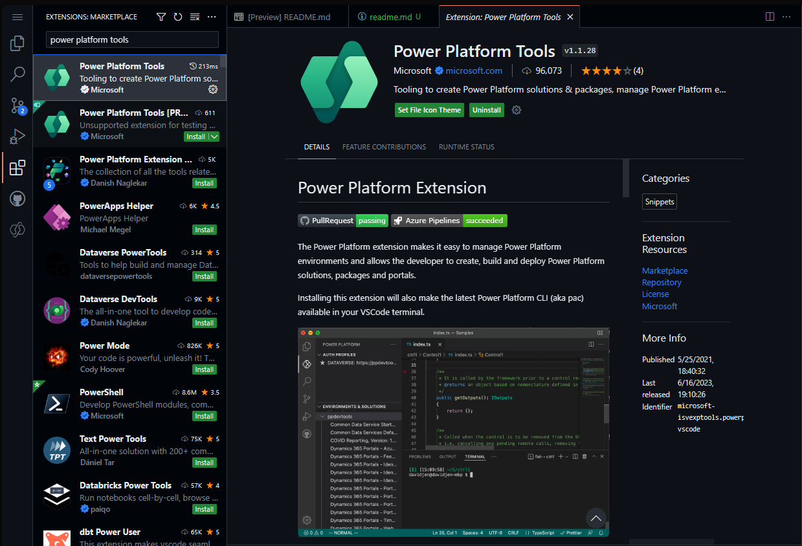
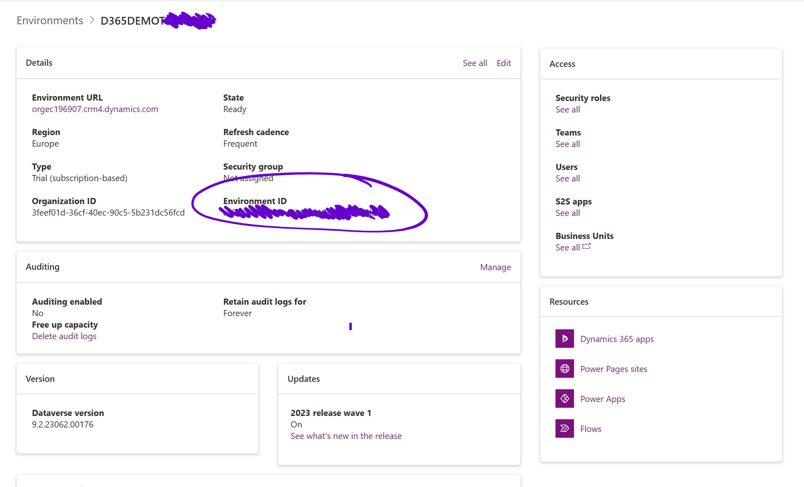
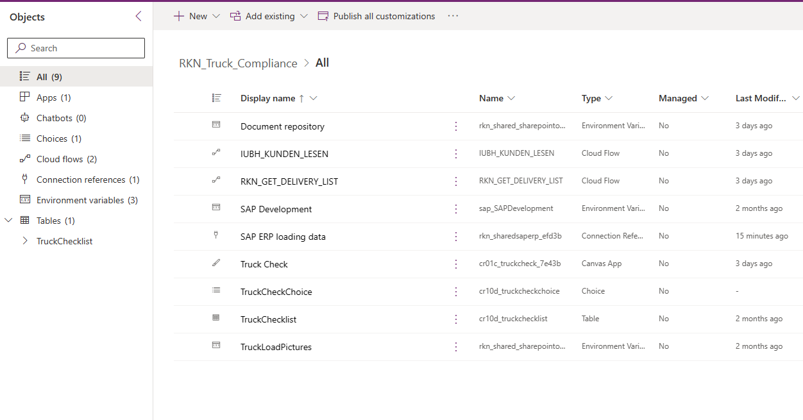

# SAP Truck loading demo

**All components are provided as-is.**
**See attached license terms under which this repository is maintained**

## Contributing

**Contributions are highly welcome! Feel free to fork the repository and create you own branch. Merges into the main branch are subject to pull request review**
If you work on your own fork be sure to adjust the URLs mentioned in Setup - Step 2 to clone your own repository instead of the current branch in this repository

## Setup

### Option 1: Build from source


1. Install Power Platform Tools


*Figure1: Install Power Platform Tools extension in VSCode*


2. Clone this repository and create a Power Platform solution from the source files using [VSCode](https://code.visualstudio.com)

```bash
$ mkdir truckloaddemo
$ cd truckloaddemo
$ git clone https://github.com/aschauera/PowerPlatform.git
$ cd SAP\ Integration/SAPTruckLoadingDemo
$ pac solution pack --zipfile TruckLoadingDemo.zip --folder ./src/
```

3. Create an authentication profile for your Dataverse environment
```bash
pac auth create --environment <EnvironmentId>
```
Note: To get the environment ID open a browser and navigate to the [Power Platform Admin center environment list](https://admin.powerplatform.microsoft.com/environments). Open the respective environment and copy the displayed ID.


*Copy the environment ID*

4. Import the solution into your environment
```bash
pac solution publish
```
The solution should be available in the environment after import finishes

**Refer to [Components - Connections](#connections) below to setup the connection to SAP**

### Option 2: Download the prebuilt solution zip file

Download the solution zip file to your computer. Open your browser and navigate to the [Power Apps Maker Portal](https://make.powerapps.com). In the left navigation und Solutions click Import solution and select the downloaded file.
The solution import will start and take a few minutes.

**Refer to [Components - Connections](#connections) below to setup the connection to SAP**

## Configuration and Components


*Solution components*

### Connections

The solution uses the SAP ERP connector.Connection references are included in the solution. 
To use the App, the a connection reference needs to be updated to point to the connection in place on the target environment.
The following connection references
- SAP ERP loading data

To create a connection, open your browser and navigate to the Connections section at the [Power Platform Maker Portal](https://make.powerapps.com).
Click + New Connection on top and search for SAP ERP. Provide the connection credentials. The connection needs an active On Premises data gateway. For details on how to setup the data gateway to SAP, refer to [SAP ERP Connector - Prerequisites](https://learn.microsoft.com/en-us/connectors/saperp/#pre-requisites)

### Apps
- Truck Check: Legacy tablet format app, with basic UI.

### Cloud flows

- IUBH_KUNDEN_LESEN: This flow is called on App start (OnStart) to read the list of customers directly from the SAP system.
The flow uses the [Power Platform SAP ERP connector](https://learn.microsoft.com/en-us/connectors/saperp/). The flow makes one call using (Read SAP table with parsing)[https://learn.microsoft.com/en-us/connectors/saperp/#read-sap-table-with-parsing] to read KNA1 from the SAP sytem. It returns the parsed JSON body of the response as a typed object to the calling app.

- RKN_GET_DELIVERY_LIST: This flow is call on App start (OnStart) to read the list of deliveries. 
The flow uses the [Power Platform SAP ERP connector](https://learn.microsoft.com/en-us/connectors/saperp/). The flow makes one call using (Read SAP table with parsing)[https://learn.microsoft.com/en-us/connectors/saperp/#read-sap-table-with-parsing] to read LIKP (SD Document: Delivery Header Data) from the SAP sytem. The read action takes two parameters to filter loadings from the calling app:
    - VSTEL: Shipping point
    - LDDAT: The loading date

    It returns the parsed JSON body of the response as a typed object to the calling app.

### Environment variables

- Document repository: Contains the URL to the SharePoint site that contains the below list for truck load pictures 
- Truck load pictures: Contains the URL to the SharePoint library with demo truck load pictures

### Tables
- TruckChecklist: Dataverse table definition to store load checks

### Choices
- TruckCheckChoice: Checklist status - Yes|Acceptable|No

# Trademarks
This project may contain trademarks or logos for projects, products, or services. Authorized use of Microsoft trademarks or logos is subject to and must follow [Microsoft's Trademark & Brand Guidelines](https://www.microsoft.com/en-us/legal/intellectualproperty/trademarks/usage/general). Use of Microsoft trademarks or logos in modified versions of this project must not cause confusion or imply Microsoft sponsorship. Any use of third-party trademarks or logos are subject to those third-party's policies.
