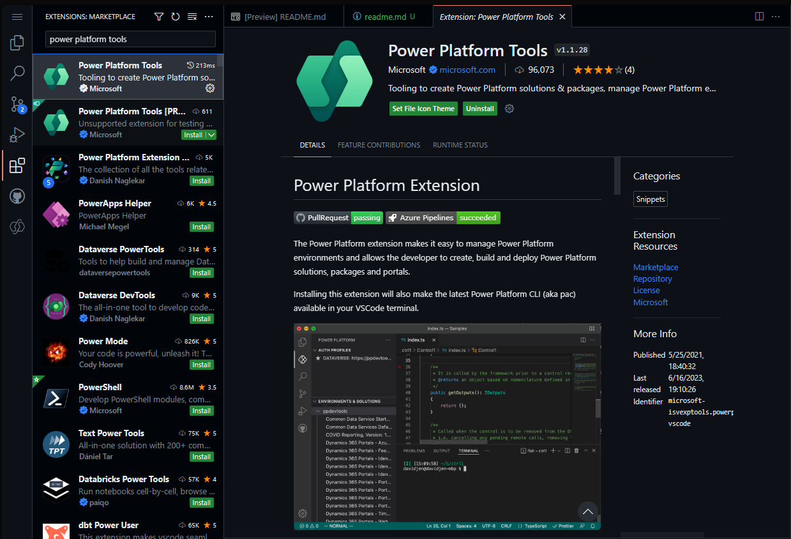

# SAP Truck loading demo

## Setup

### Option 1: Build from source

Clone this repository and create a Power Platform solution from the source files using [VSCode](https://code.visualstudio.com)

*Figure1: Install Power Platform Tools extension in VSCode*

### Option 2: Download the solution zip file

Download the solution zip file to your computer. Open your browser and navigate to the [Power Apps Maker Portal](https://make.powerapps.com). In the left navigation und Solutions click Import solution and select the downloaded file.
The solution import will start and take a few minutes.

## Configuration

## Components

### Connections
### Apps
### Cloud flows

- IUBH_KUNDEN_LESEN: This flow is called on App start (OnStart) to read the list of customers directly from the SAP system.
The flow uses the [Power Platform SAP ERP connector](https://learn.microsoft.com/en-us/connectors/saperp/). The flow makes one call using (Read SAP table with parsing)[https://learn.microsoft.com/en-us/connectors/saperp/#read-sap-table-with-parsing] to read KNA1 from the SAP sytem. It returns the parsed JSON body of the response as a typed object to the calling app.

- RKN_GET_DELIVERY_LIST: This flow is call on App start (OnStart) to read the list of deliveries. 
The flow uses the [Power Platform SAP ERP connector](https://learn.microsoft.com/en-us/connectors/saperp/). The flow makes one call using (Read SAP table with parsing)[https://learn.microsoft.com/en-us/connectors/saperp/#read-sap-table-with-parsing] to read LIKP (SD Document: Delivery Header Data) from the SAP sytem. The read action takes two parameters to filter loadings from the calling app:
    - VSTEL: Shipping point
    - LDDAT: The loading date

    It returns the parsed JSON body of the response as a typed object to the calling app.
